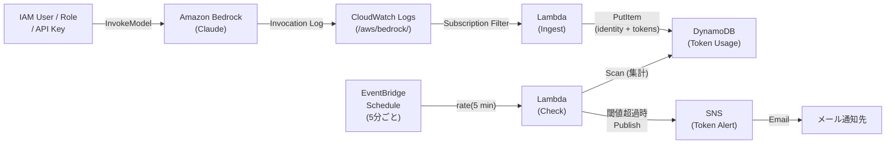

# Bedrock トークン使用量モニター

Bedrock 経由の Claude モデル利用において、IAMユーザー / IAMロール / APIキーごとのトークン使用量（入力＋出力）を監視し、閾値を超えた場合にメール通知する仕組みです。

## アーキテクチャ



### 処理の流れ

1. Bedrock の Model Invocation Logging が CloudWatch Logs にログを出力
2. Subscription Filter がログを検知し、Ingest Lambda を起動
3. Ingest Lambda がログの `identity.arn` をキーにトークン数を DynamoDB に記録
4. EventBridge Schedule が5分ごとに Check Lambda を起動
5. Check Lambda が DynamoDB を走査し、直近ウィンドウ内の identity ごとのトークン合計を集計
6. 閾値を超えた identity があれば SNS 経由でメール通知

## 前提条件

- AWS SAM CLI がインストール済みであること
- Bedrock Model Invocation Logging が有効化済みで、CloudWatch Logs にログが出力されていること
- ロググループ（デフォルト: `/aws/bedrock/`）が既に存在すること

## デプロイ

### 事前準備

- AWS CLIのインストール

[こちら](https://docs.aws.amazon.com/ja_jp/cli/latest/userguide/getting-started-install.html)を参考にCLIのインストールとクレデンシャル設定を行ってください。

- AWS SAMのインストール

[こちら](https://docs.aws.amazon.com/ja_jp/serverless-application-model/latest/developerguide/install-sam-cli.html)を参考にAWS SAM CLIのインストールを行ってください。

### 基本（必須パラメータのみ）

```bash
SNS_EMAIL=alert@example.com ./deploy.sh
```

### 全パラメータ指定

```bash
SNS_EMAIL=alert@example.com \
STACK_NAME=bedrock-token-monitor \
AWS_REGION=ap-northeast-1 \
SNS_TOPIC_NAME=bedrock-token-alert \
BEDROCK_LOG_GROUP=/aws/bedrock/ \
./deploy.sh
```

> **注意**: `TokenThreshold` / `WindowMinutes` / `ScheduleRateMinutes` は `deploy.sh` 経由では変更できません。変更する場合は後述の「[パラメータの変更](#パラメータの変更)」を参照してください。

### デプロイ後

SNS からサブスクリプション確認メール（Subscription Confirmation）が届きます。
メール内の「Confirm subscription」リンクをクリックしないと通知が届きません。

## パラメータ一覧

| 環境変数 | template.yaml パラメータ | デフォルト値 | 説明 |
|---|---|---|---|
| `SNS_EMAIL` | `SnsEmail` | （必須） | 通知先メールアドレス |
| `STACK_NAME` | - | `bedrock-token-monitor` | CloudFormation スタック名 |
| `AWS_REGION` | - | `ap-northeast-1` | デプロイ先リージョン |
| `SNS_TOPIC_NAME` | `SnsTopicName` | `bedrock-token-alert` | SNS トピック名 |
| `BEDROCK_LOG_GROUP` | `BedrockLogGroupName` | `/aws/bedrock/` | Bedrock ログのロググループ名 |
| （`sam deploy` 直接実行） | `TokenThreshold` | `1000000` | identity あたりのトークン閾値（入力＋出力合計） |
| （`sam deploy` 直接実行） | `WindowMinutes` | `10` | 集計対象のスライディングウィンドウ（分） |
| （`sam deploy` 直接実行） | `ScheduleRateMinutes` | `5` | Check Lambda の実行間隔（分） |

## パラメータの変更

`TokenThreshold` / `WindowMinutes` / `ScheduleRateMinutes` を変更する場合は `sam deploy` を直接実行します。

### 初回デプロイ時にカスタム値を指定

```bash
sam build --template-file template.yaml

sam deploy \
  --stack-name bedrock-token-monitor \
  --region ap-northeast-1 \
  --resolve-s3 \
  --capabilities CAPABILITY_IAM \
  --no-fail-on-empty-changeset \
  --parameter-overrides \
    SnsEmail=alert@example.com \
    SnsTopicName=bedrock-token-alert \
    BedrockLogGroupName=/aws/bedrock/ \
    TokenThreshold=1000000 \
    WindowMinutes=10 \
    ScheduleRateMinutes=5

```

### デプロイ済みスタックのパラメータを変更

同じ `sam deploy` コマンドを新しい値で再実行するだけです（Termination Protection はスタック削除を防ぐものであり、更新には影響しません）:

```bash
sam build --template-file template.yaml

sam deploy \
  --stack-name bedrock-token-monitor \
  --region ap-northeast-1 \
  --resolve-s3 \
  --capabilities CAPABILITY_IAM \
  --no-fail-on-empty-changeset \
  --parameter-overrides \
    SnsEmail=alert@example.com \
    TokenThreshold=2000000
```

## 作成されるリソース

| リソース | 種類 | 説明 |
|---|---|---|
| SNS Topic | `AWS::SNS::Topic` | メール通知用（KMS 暗号化付き） |
| SNS Subscription | `AWS::SNS::Subscription` | メールアドレスの登録 |
| DynamoDB Table | `AWS::DynamoDB::Table` | identity ごとのトークン記録（TTL・SSE 暗号化付き） |
| Ingest Lambda | `AWS::Serverless::Function` | ログ受信 → DynamoDB 記録（同時実行数 10 に制限） |
| Check Lambda | `AWS::Serverless::Function` | 定期集計 → 閾値判定 → SNS 通知 |
| Subscription Filter | `AWS::Logs::SubscriptionFilter` | CloudWatch Logs → Ingest Lambda |
| EventBridge Schedule | Schedule イベント | Check Lambda の定期実行 |

## DynamoDB TTL 設定

トークン使用量レコードは DynamoDB の TTL（Time To Live）機能により自動削除されます。

### TTL の計算

Ingest Lambda がレコードを書き込む際、以下の式で TTL を設定します（`src/ingest.py`）:

```
ttl = 書き込み時刻（Unix エポック秒） + WindowMinutes × 60 + 300
```

デフォルト（`WindowMinutes=10`）では **書き込みから 15 分後** に失効します。

| 要素 | 秒数 | 説明 |
|---|---|---|
| `WindowMinutes × 60` | 600秒（10分） | 集計ウィンドウ幅 |
| バッファ | 300秒（5分） | DynamoDB の TTL 削除遅延に備えた余裕 |

### ウィンドウ外レコードの扱い

DynamoDB の TTL 削除は非同期のため、期限切れから実際の削除まで最大数十分かかる場合があります。
Check Lambda は TTL 失効済みでも残っているレコードを誤集計しないよう、`epoch` フィールドで明示的にウィンドウ内のレコードのみをフィルタリングしています（`src/check.py`）:

```python
cutoff_epoch = int(time.time()) - (WINDOW_MINUTES * 60)
# epoch が cutoff_epoch 未満のレコードはスキップ
```

## セキュリティ設計

### IAM 最小権限

- **Ingest Lambda**: `dynamodb:PutItem` / `dynamodb:BatchWriteItem` のみ許可（書き込み専用）
- **Check Lambda**: `DynamoDBReadPolicy`（読み取り専用）＋ SNS Publish のみ許可
- **Ingest Lambda の呼び出し元制限**: `SourceArn` で Bedrock のロググループからの呼び出しのみ許可

### 保存データの暗号化

- **DynamoDB**: SSE（Server-Side Encryption）を有効化。IAM ARN 等の個人識別情報を暗号化して保存
- **SNS**: AWS マネージドキー（`alias/aws/sns`）による KMS 暗号化を有効化

### データ保護

- **DynamoDB `DeletionPolicy: Retain`**: CloudFormation スタック削除時もテーブルを保持
- **DynamoDB `UpdateReplacePolicy: Retain`**: スタック更新時の意図しないテーブル再作成を防止

### スロットリング

- **Ingest Lambda `ReservedConcurrentExecutions: 10`**: 大量ログ流入時のアカウント全体への同時実行数消費を防止

## 削除

```bash
aws cloudformation delete-stack --stack-name bedrock-token-monitor --region ap-northeast-1
```

> **注意**: DynamoDB テーブルは `DeletionPolicy: Retain` のため、スタック削除後もテーブルが残ります。テーブルも削除する場合は別途 AWS コンソールまたは CLI で削除してください。
