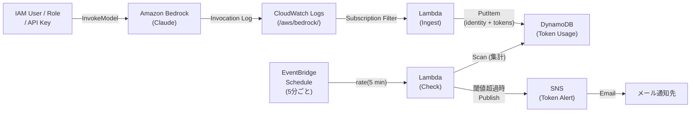

# Bedrock トークン使用量モニター

Bedrock 経由の Claude モデル利用において、IAMユーザー / IAMロール / APIキーごとのトークン使用量（入力＋出力）を監視し、閾値を超えた場合にメール通知する仕組みです。

## アーキテクチャ



### 処理の流れ

1. Bedrock の Model Invocation Logging が CloudWatch Logs にログを出力
2. Subscription Filter がログを検知し、Ingest Lambda を起動
3. Ingest Lambda がログの `identity.arn` をキーにトークン数を DynamoDB に記録
4. EventBridge Schedule が5分ごとに Check Lambda を起動
5. Check Lambda が DynamoDB を走査し、直近ウィンドウ内の identity ごとのトークン合計を集計
6. 閾値を超えた identity があれば SNS 経由でメール通知

## 前提条件

- AWS SAM CLI がインストール済みであること
- Bedrock Model Invocation Logging が有効化済みで、CloudWatch Logs にログが出力されていること
- ロググループ（デフォルト: `/aws/bedrock/`）が既に存在すること

## デプロイ

### 基本（必須パラメータのみ）

```bash
SNS_EMAIL=alert@example.com ./deploy.sh
```

### 全パラメータ指定

```bash
SNS_EMAIL=alert@example.com \
STACK_NAME=bedrock-token-monitor \
AWS_REGION=ap-northeast-1 \
SNS_TOPIC_NAME=bedrock-token-alert \
BEDROCK_LOG_GROUP=/aws/bedrock/ \
./deploy.sh
```

### デプロイ後

SNS からサブスクリプション確認メール（Subscription Confirmation）が届きます。
メール内の「Confirm subscription」リンクをクリックしないと通知が届きません。

## パラメータ一覧

| 環境変数 | template.yaml パラメータ | デフォルト値 | 説明 |
|---|---|---|---|
| `SNS_EMAIL` | `SnsEmail` | （必須） | 通知先メールアドレス |
| `STACK_NAME` | - | `bedrock-token-monitor` | CloudFormation スタック名 |
| `AWS_REGION` | - | `ap-northeast-1` | デプロイ先リージョン |
| `SNS_TOPIC_NAME` | `SnsTopicName` | `bedrock-token-alert` | SNS トピック名 |
| `BEDROCK_LOG_GROUP` | `BedrockLogGroupName` | `/aws/bedrock/` | Bedrock ログのロググループ名 |
| - | `TokenThreshold` | `1000000` | identity あたりのトークン閾値（入力＋出力合計） |
| - | `WindowMinutes` | `10` | 集計対象のスライディングウィンドウ（分） |
| - | `ScheduleRateMinutes` | `5` | Check Lambda の実行間隔（分） |

## トークン閾値の変更

### デプロイ時に指定

`deploy.sh` の `--parameter-overrides` に追加するか、直接 `sam deploy` を実行します:

```bash
sam deploy \
  --stack-name bedrock-token-monitor \
  --resolve-s3 \
  --capabilities CAPABILITY_IAM \
  --parameter-overrides \
    SnsEmail=alert@example.com \
    TokenThreshold=1000000 \
    WindowMinutes=10
```

### デプロイ済みスタックの閾値を変更

同じコマンドを新しい閾値で再実行するだけです。スタックが更新されます:

```bash
sam deploy \
  --stack-name bedrock-token-monitor \
  --resolve-s3 \
  --capabilities CAPABILITY_IAM \
  --parameter-overrides \
    SnsEmail=alert@example.com \
    TokenThreshold=2000000
```

## 作成されるリソース

| リソース | 種類 | 説明 |
|---|---|---|
| SNS Topic | `AWS::SNS::Topic` | メール通知用 |
| SNS Subscription | `AWS::SNS::Subscription` | メールアドレスの登録 |
| DynamoDB Table | `AWS::DynamoDB::Table` | identity ごとのトークン記録（TTL で自動削除） |
| Ingest Lambda | `AWS::Serverless::Function` | ログ受信 → DynamoDB 記録 |
| Check Lambda | `AWS::Serverless::Function` | 定期集計 → 閾値判定 → SNS 通知 |
| Subscription Filter | `AWS::Logs::SubscriptionFilter` | CloudWatch Logs → Ingest Lambda |
| EventBridge Schedule | Schedule イベント | Check Lambda の定期実行 |

## 削除

```bash
aws cloudformation delete-stack --stack-name bedrock-token-monitor --region ap-northeast-1
```
